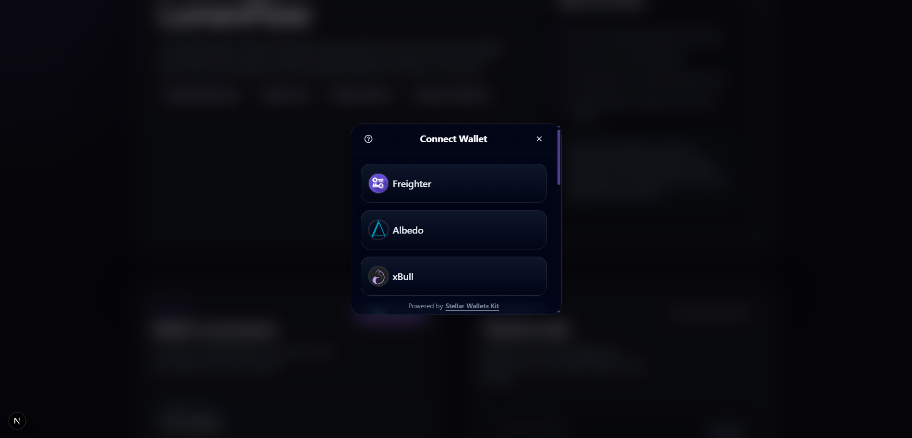
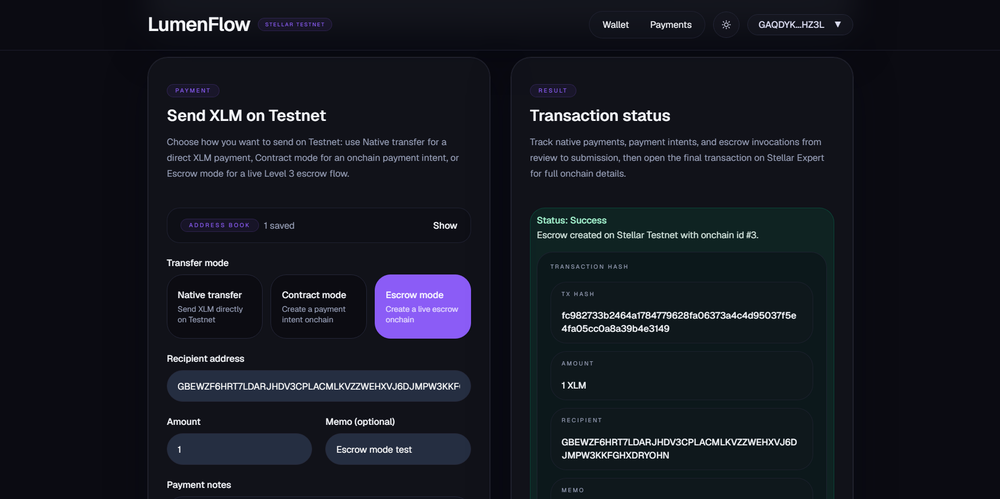
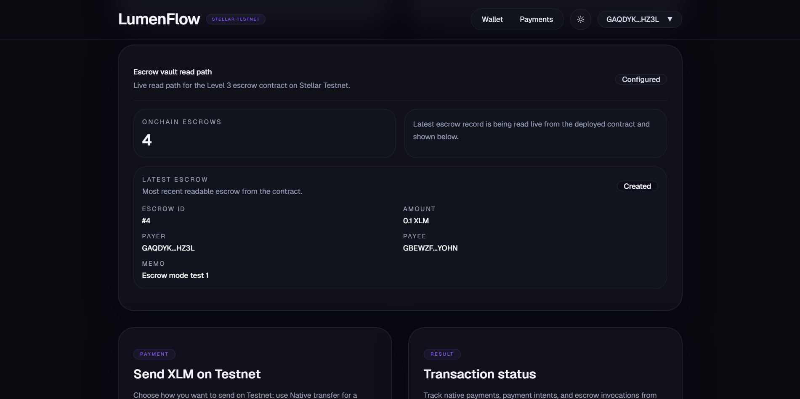

# LumenFlow — Stellar Testnet Payment App

LumenFlow is a Stellar Testnet payment dApp with multi-wallet support, native XLM transfer, a live Payment Intent flow, and a live Level 3 escrow flow.

## Current Status

Level 2 core requirements are implemented and verified locally, and Level 3 escrow is live on local/Testnet wiring:
- multi-wallet connection works on Stellar Testnet
- XLM balance display works
- native XLM transfer remains live
- Payment Intent contract is deployed on Stellar Testnet
- Escrow vault contract is deployed on Stellar Testnet
- contract mode is called from the frontend
- escrow mode is called from the frontend
- transaction states are visible in the UI (`validating`, `signing`, `submitting`, `success`, `error`)
- local/live escrow flow has been verified against Testnet
- public Vercel deployment still needs a separate credentialed sync before it reflects escrow mode

## Live capabilities

- connect supported Stellar wallets
- disconnect wallet session
- display connected wallet XLM balance
- handle funded and unfunded Testnet accounts
- send native XLM payments on Stellar Testnet
- create Payment Intent records through a deployed Stellar smart contract
- create Level 3 escrow records through a deployed Stellar smart contract
- read contract-created payment and escrow records back into the UI
- show transaction status, hash, recipient, amount, memo, and onchain id
- save and reuse recipient addresses with the local Address Book

## Level 2 requirement coverage

### Required items
- **3 error types handled**
  - wrong network: user is told to switch to Stellar Testnet
  - unfunded account: user is prompted to fund with Friendbot before sending
  - wallet / signing / submission failure: connect, signature, and submission failures surface as visible error states
- **Contracts deployed on Testnet**
  - Payment Intent contract ID: `CBAEFZC6GIYE5H7ZDN3JVHH3TDAWBP5VGZCWWH4TDANWUIE2GXQWAGHO`
  - Escrow vault contract ID: `CDY4BP6KMWEUSHRJFIBZVJW2TQN3BAX2VB3FAH6XCKDRDNVUJFJ6EDIQ`
- **Contracts called from the frontend**
  - contract mode builds, signs, submits, and reads back a Payment Intent from the frontend flow
  - escrow mode builds, signs, submits, and reads back live escrow records from the same frontend flow
- **Transaction status visible**
  - UI states: `validating`, `signing`, `submitting`, `success`, `error`
- **Minimum 2+ meaningful commits**
  - satisfied in repository history

## Level 3 escrow coverage (local/Testnet, ahead of public site)
- `escrow-vault` contract deployed to Stellar Testnet with `create_escrow`, `release_escrow`, `refund_escrow`, `get_escrow`, and `get_escrow_count`
- 6 passing Rust contract tests (create, release, refund, and rejection paths)
- frontend Escrow mode creates a live onchain escrow with recipient / amount / memo
- frontend escrow read card shows live count and latest escrow record from the deployed contract
- live create-escrow flow was verified end-to-end against the redeployed Testnet contract (see transaction hash above)
- public Vercel deployment still needs a separate credentialed redeploy before it reflects escrow mode

## Submission evidence

### Repository
- Public GitHub repository:
  - https://github.com/tommycuong1904/lumenflow

### Deployed contracts

#### Payment Intent (Level 2)
- Contract ID:
  - `CBAEFZC6GIYE5H7ZDN3JVHH3TDAWBP5VGZCWWH4TDANWUIE2GXQWAGHO`
- Deploy transaction:
  - `1d910b784a363a499c23265397cddbbcba77540e25f9d72ec9c440dced40401e`
- Contract explorer link:
  - https://lab.stellar.org/r/testnet/contract/CBAEFZC6GIYE5H7ZDN3JVHH3TDAWBP5VGZCWWH4TDANWUIE2GXQWAGHO

#### Escrow Vault (Level 3)
- Contract ID:
  - `CDY4BP6KMWEUSHRJFIBZVJW2TQN3BAX2VB3FAH6XCKDRDNVUJFJ6EDIQ`
- Deploy transaction:
  - `2c1fb056b52934f39a047a2fb0174978afcb1ba22d3ba8dcb4c3e4acb60b0005`
- Live create-escrow verification transaction:
  - `d1ea87d8b006fcfd8bb1e62f7eaeeb9f9642eb1ed28c0cb3ee3751ce06c2a92d`
- Contract explorer link:
  - https://lab.stellar.org/r/testnet/contract/CDY4BP6KMWEUSHRJFIBZVJW2TQN3BAX2VB3FAH6XCKDRDNVUJFJ6EDIQ


## Tech Stack

- Next.js 16
- React 19
- TypeScript
- Tailwind CSS 4
- `@stellar/stellar-sdk`
- `@stellar/freighter-api`
- `@creit.tech/stellar-wallets-kit`

## Local Setup

### Prerequisites
- Node.js 18+ recommended
- npm
- a supported Stellar browser wallet
- Stellar Testnet selected in the wallet

### Install

```bash
npm install
```

### Environment

```bash
cp .env.example .env.local
```

Required frontend contract values:

```env
NEXT_PUBLIC_SOROBAN_RPC_URL=https://soroban-testnet.stellar.org
NEXT_PUBLIC_PAYMENT_INTENT_CONTRACT_ID=CBAEFZC6GIYE5H7ZDN3JVHH3TDAWBP5VGZCWWH4TDANWUIE2GXQWAGHO
NEXT_PUBLIC_ESCROW_VAULT_CONTRACT_ID=CDY4BP6KMWEUSHRJFIBZVJW2TQN3BAX2VB3FAH6XCKDRDNVUJFJ6EDIQ
```

### Run development server

```bash
npm run dev
```

Default local URL:

```text
http://localhost:3000
```

### Production build

```bash
npm run build
npm run start
```

### Public demo

```text
https://lumenflow-one.vercel.app/
```

Public note:
- the public site is currently behind local/Testnet escrow work until a separate Vercel credentialed redeploy is run

## How to use

1. Open LumenFlow in a browser with a supported Stellar wallet installed.
2. Switch the wallet to Stellar Testnet.
3. Connect the wallet.
4. If the account is unfunded, use Friendbot.
5. Confirm the XLM balance is visible.
6. Choose either:
   - **Native transfer** for a direct XLM payment
   - **Contract mode** to create a payment intent onchain
7. Review the payment details.
8. Sign in the wallet.
9. Wait for the transaction result and hash.

## Verification summary

- `npm run build` passes
- contract crate builds for `wasm32v1-none` release target
- contract is deployed to Stellar Testnet
- wallet connect was re-verified on the public website
- contract mode was manually tested successfully on the public website
- native transfer remains preserved alongside contract mode
- escrow mode is verified locally/Testnet, but public website sync is still pending a separate redeploy

## Screenshots

Current screenshot set in the repo:
- wallet connected
- balance displayed
- send form filled
- transaction success
- unfunded / Friendbot state
- disconnected state
- wallet options available
- dark/light mode
- wallet QR code
- Address Book

### Included screenshots

| Wallet connected | Balance displayed |
|---|---|
|  |  |

| Send form filled | Transaction success |
|---|---|
|  |  |

| Friendbot / unfunded state | Wallet disconnected state |
|---|---|
|  |  |

| Wallet options available |
|---|
|  |

| Escrow mode selected | Escrow live record |
|---|---|
|  |  |

| Dark / Light mode | Wallet QR code | Address Book |
|---|---|---|
|  |  |  |

### Submission note on screenshots
- The screenshot set now includes the wallet options picker/modal to show multi-wallet selection directly in the UI.
- The current screenshots cover the main app states, successful transaction flow, and wallet selection evidence for the current Testnet payment flow.

Full checklist and naming guide: [`docs/screenshots/README.md`](docs/screenshots/README.md)

## Project Structure

```text
src/
  app/
    layout.tsx
    page.tsx
    globals.css
  components/
    AddressBook.tsx
    BalanceCard.tsx
    SendPaymentForm.tsx
    ThemeToggle.tsx
    TxResultCard.tsx
    WalletCard.tsx
    WalletQrCode.tsx
    ui/
      alert.tsx
      badge.tsx
      button.tsx
      card.tsx
      input.tsx
      label.tsx
      separator.tsx
      textarea.tsx
  lib/
    stellar/
      addressBook.ts
      constants.ts
      contract.ts
      contract-payload.ts
      contract-rpc.ts
      horizon.ts
      submit.ts
      transactions.ts
      types.ts
      validation.ts
      wallet.ts
    utils/
      format.ts
    utils.ts

contracts/
  payment-intent/
    Cargo.toml
    Cargo.lock
    src/
      lib.rs

docs/
  challenge.md
  contract-deploy-checklist.md
  project-brief.md
  progress.md
  reference-starter-template.md
  screenshots/
```

## Notes

- The app is Testnet-only for this challenge stage.
- Native-transfer functionality was preserved while adding payment-intent and escrow flows.
- `docs/challenge.md` is the source of truth for challenge wording.
