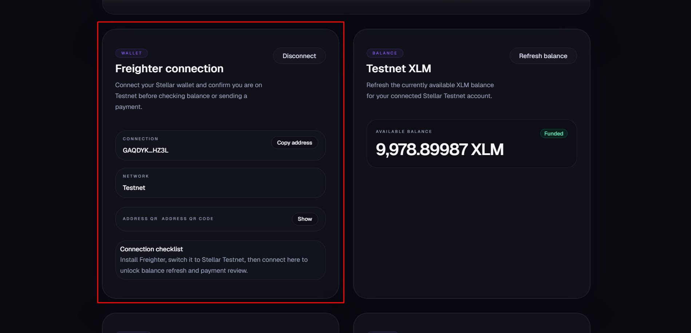
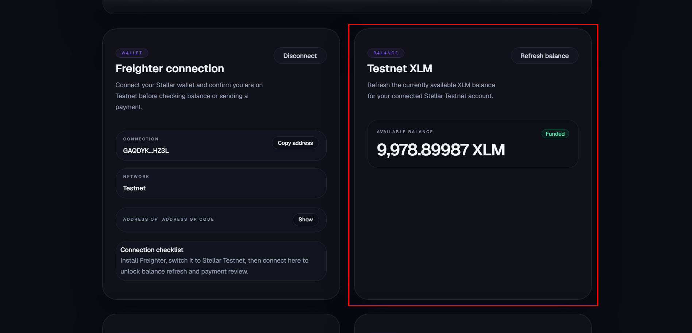
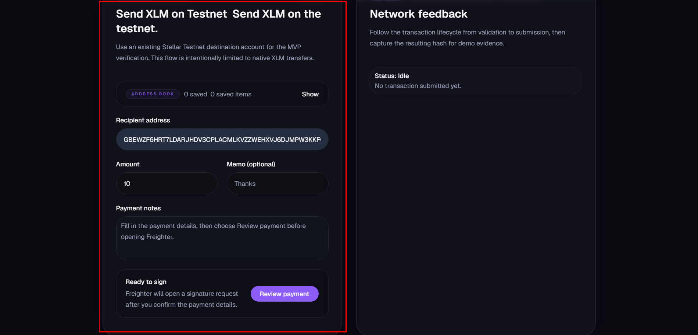
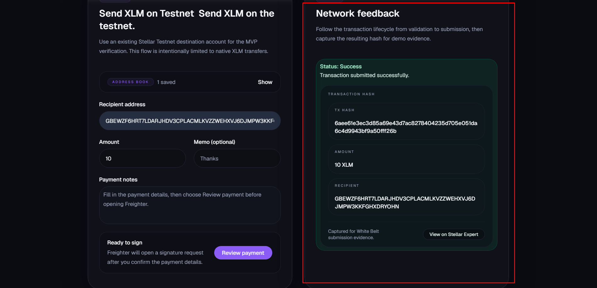
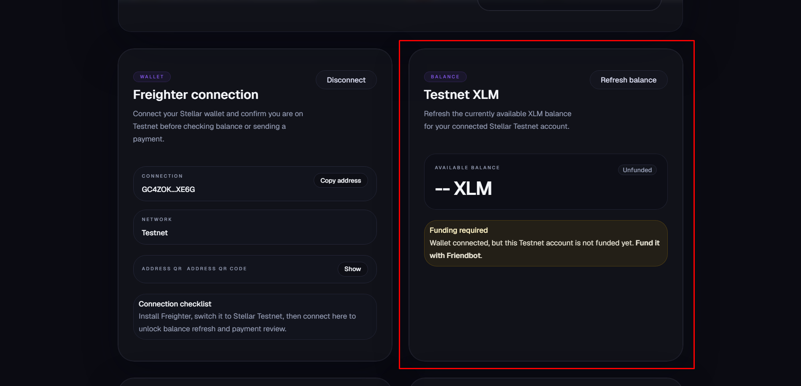
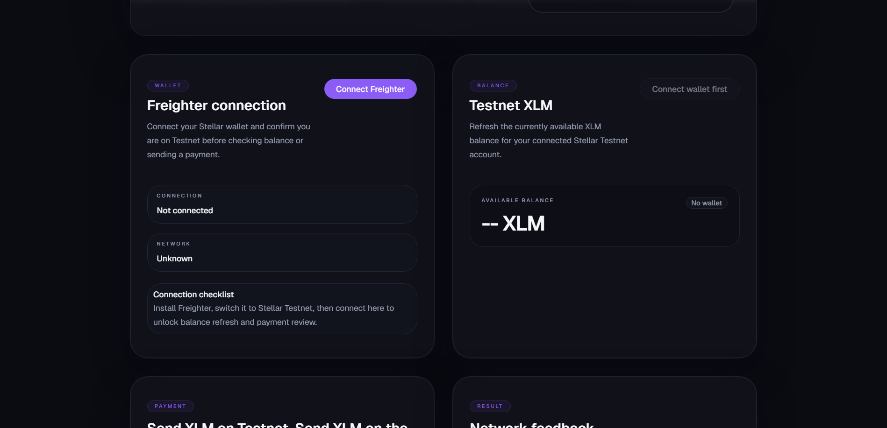
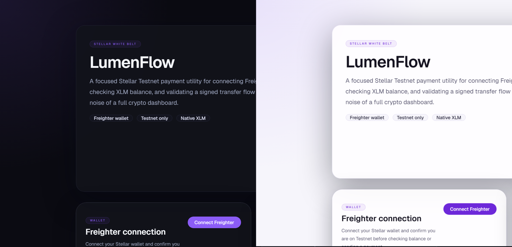
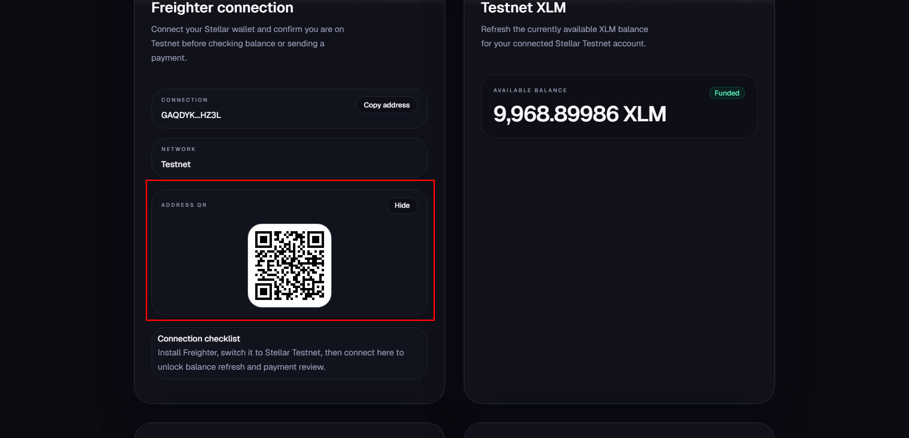
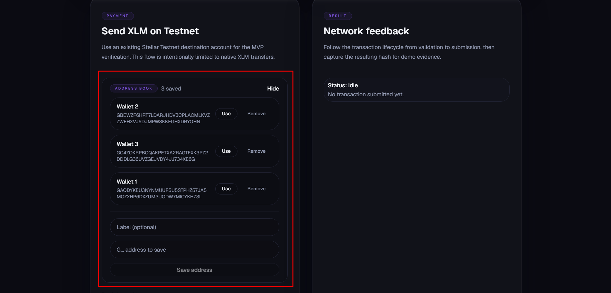

# LumenFlow — Stellar Testnet Payment App

LumenFlow is evolving from a Stellar White Belt / Level 1 payment MVP into a Level 2 Testnet dApp with multi-wallet support and a staged smart-contract payment flow.

Current live capabilities:

- connect supported Stellar wallets
- display the connected wallet's XLM balance
- send a native XLM payment on Stellar Testnet
- show success or failure feedback after transaction submission

Current integration work in progress:

- Payment Intent contract scaffold under `contracts/payment-intent`
- frontend contract-mode invoke/read flow and state handling
- Soroban RPC / contract config path for post-deploy wiring

## Current Status

The native transfer path remains live and build-verified. Level 2 contract mode is under active integration and is not yet deploy-complete.

What is complete right now:
- multi-wallet connection foundation in the UI
- Testnet-only wallet/network checks
- Horizon-based XLM balance lookup
- native XLM payment transaction creation
- explicit **transaction confirmation step** before signing
- wallet signing flow integration for the native transfer path
- transaction submission flow and feedback UI, with a full receipt (Status, Tx hash, Amount, Recipient, Memo, Stellar Expert link)
- Address Book: save/label/reuse frequent recipient addresses via `localStorage`, with auto-save of the recipient after a successful send
- clean error, loading, and disabled states
- responsive layout for mobile and desktop
- Dark/Light mode, wallet address QR code, and UI animation polish
- contract-mode live path, helper files, and env/config wiring for the deployed testnet contract

Known gap:
- final end-to-end verification still requires a real browser wallet session for live signing.

Native-flow manual verification and previous screenshot capture are complete — see below.

## Tech Stack

- Next.js 16
- React 19
- TypeScript
- Tailwind CSS 4
- `@stellar/stellar-sdk`
- `@stellar/freighter-api`

## Requirements Coverage

### 1. Wallet Setup
- Supported Stellar wallets can be connected from the app UI
- App is built specifically for Stellar Testnet

### 2. Wallet Connection
- Connect wallet flow is implemented
- Disconnect flow is implemented in the UI state
- Copy address utility is provided

### 3. Balance Handling
- Connected wallet XLM balance is fetched from Horizon Testnet
- Balance is displayed in the UI
- Unfunded account state is handled with a Friendbot prompt

### 4. Transaction Flow
- Native XLM payment transaction is created with Stellar SDK
- Explicit review/confirmation step precedes signing
- Native transactions are signed through a supported Stellar wallet
- Signed transaction is submitted to Stellar Testnet
- Success or failure feedback is shown in the UI
- Full receipt shown after successful submission: Status, Tx hash, Amount, Recipient, Memo (when provided), and a link to Stellar Expert

### 5. Bonus Features
- Dark/Light mode toggle (persisted via `next-themes`)
- QR code for the connected wallet address
- Entrance/transition animations across the main UI sections
- Address Book: save frequently used recipient addresses with a label, reuse them with one click, remove them, and auto-save the recipient after every successful send — all stored client-side in `localStorage`
- Wallet session persistence: staying connected across a page refresh or a new tab, without needing to click Connect again (the wallet only re-prompts if access was actually revoked)

## Local Setup

### Prerequisites
- Node.js 18+ recommended
- npm
- A supported Stellar browser wallet

### Install

```bash
npm install
```

### Environment (optional for Level 2)

```bash
cp .env.example .env.local
```

Use this when you want to wire the deployed Payment Intent contract into the frontend.

### Run development server

```bash
npm run dev
```

Default Next.js local URL:

```text
http://localhost:3000
```

Current workspace note:

```text
LumenFlow is accessible for production-style preview via IP at http://156.67.24.44:3002/ 
(Port 3001 is reserved for SettleFlow).
```

### Production build

```bash
npm run build
npm run start
```

## How to Use

1. Open LumenFlow in a browser with a supported Stellar wallet installed.
2. Switch the wallet to Stellar Testnet.
3. Connect the wallet.
4. If the account is unfunded, use Friendbot.
5. Confirm the XLM balance is visible.
6. Enter a recipient address and amount.
7. Sign the transaction in your wallet.
8. Wait for the transaction result and hash.

## Testnet Notes

### Horizon endpoint
```text
https://horizon-testnet.stellar.org
```

### Friendbot
```text
https://friendbot.stellar.org/?addr=<PUBLIC_KEY>
```

## Screenshots

These screenshots were captured during the native transfer flow on Stellar Testnet.

### Core flow

| Wallet connected | Balance displayed |
|---|---|
|  |  |

| Send form filled | Transaction success |
|---|---|
|  |  |

### Additional states

| Friendbot / unfunded state | Wallet disconnected state |
|---|---|
|  |  |

### Bonus features

| Dark / Light mode | Wallet QR code | Address Book |
|---|---|---|
|  |  |  |

Full checklist and naming guide: [`docs/screenshots/README.md`](docs/screenshots/README.md)

## Project Structure

```text
src/
  app/
    layout.tsx
    page.tsx
    globals.css
  components/
    AddressBook.tsx
    BalanceCard.tsx
    SendPaymentForm.tsx
    ThemeToggle.tsx
    TxResultCard.tsx
    WalletCard.tsx
    WalletQrCode.tsx
    ui/
      alert.tsx
      badge.tsx
      button.tsx
      card.tsx
      input.tsx
      label.tsx
      separator.tsx
      textarea.tsx
  lib/
    stellar/
      addressBook.ts
      constants.ts
      contract.ts
      contract-payload.ts
      contract-rpc.ts
      horizon.ts
      submit.ts
      transactions.ts
      types.ts
      validation.ts
      wallet.ts
    utils/
      format.ts
    utils.ts

docs/
  project-brief.md
  progress.md
  reference-starter-template.md
  screenshots/
```

## Notes

- Manual end-to-end verification was completed on Stellar Testnet for the native transfer path (connect, balance, copy address, QR code, send payment, receipt fields, Address Book, session persistence) — all checks passed.
- The project has now expanded beyond the original Level 1 MVP and is being prepared for contract-backed Level 2 flow while preserving the stable native transfer path.
- Future expansion can build on the same `LumenFlow` product line if later challenge levels allow it (e.g. evolving into a Payment Tracker or Approval-to-Settlement Workflow).
- When `stellar-cli` finishes installing, use [`docs/contract-deploy-checklist.md`](docs/contract-deploy-checklist.md) as the next-step runbook.

## Repository

https://github.com/tommycuong1904/lumenflow
