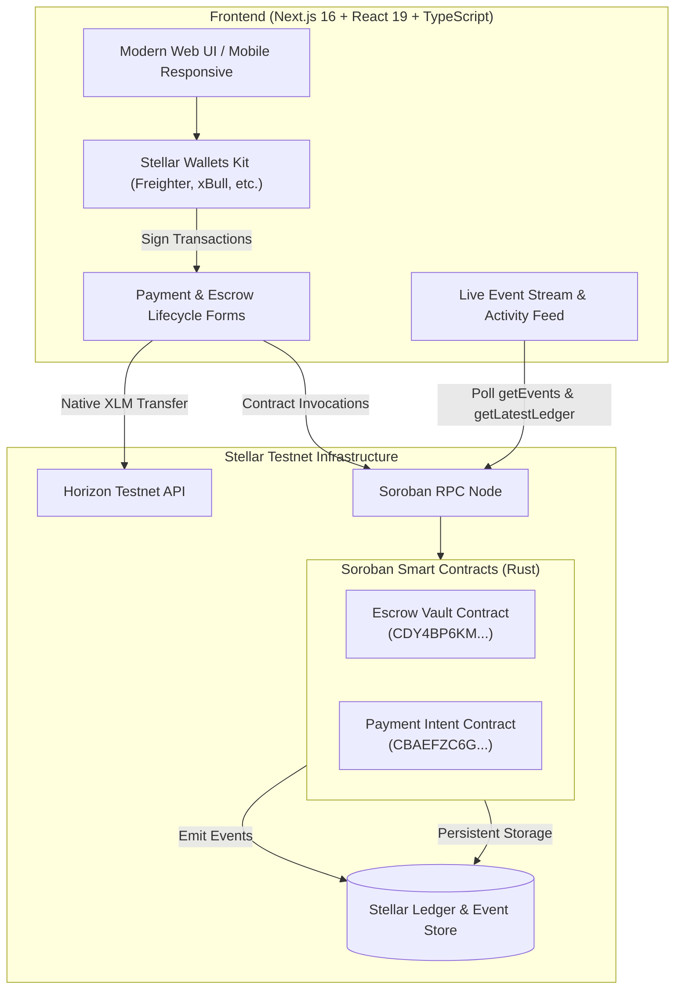
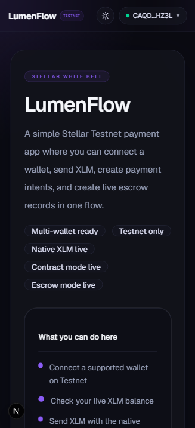
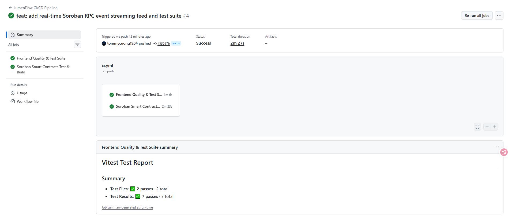
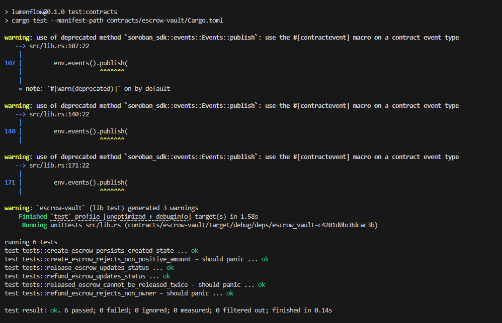

# LumenFlow — Production-Ready Stellar dApp & Escrow Vault

[](https://stellar.org)
[](https://soroban.stellar.org)
[-darkorange.svg)](https://stellar.org)
[](https://github.com/tommycuong1904/lumenflow/actions)
[](https://github.com/tommycuong1904/lumenflow/actions)

LumenFlow is an end-to-end, production-ready Stellar decentralized application (dApp) featuring Soroban smart contracts, live onchain event streaming, interactive multi-wallet payments, and complete escrow lifecycle management on Stellar Testnet.

---

## 🏛️ System Architecture



---

## 🚀 Key Features & Level 3 Requirements Coverage

### 1. Advanced Smart Contract Development (`contracts/escrow-vault`)
- **State Machine**: Supports lifecycle states (`Created` ➔ `Released` / `Refunded`).
- **Authorization & Security**: Enforces `payer.require_auth()` and state guards to prevent double-spending or unauthorized release/refund.
- **Event Emission**: Emits structured Soroban events (`created`, `released`, `refunded`) with topics and payloads for every state transition.
- **Data Persistence**: Uses Soroban persistent storage with `DataKey::Escrow(id)` and atomic counter management.

### 2. Event Streaming & Real-time Updates
- **Live Ingestion**: Connects directly to Soroban RPC via `rpc.Server.getEvents` to ingest all contract events within the retention ledger window.
- **Decoders**: Safely decodes base64 XDR `ScVal` topics and values into typed TypeScript event objects.
- **Interactive Feed UI**: [`ContractEventFeed.tsx`](src/components/ContractEventFeed.tsx) includes:
  - 🟢 Live status pulse indicator (*Active Polling*) & latest ledger height tracking.
  - Automatic background polling every 7 seconds with an on/off toggle.
  - Event filter tabs: *All*, *Created*, *Released*, *Refunded*.
  - Instant auto-refresh trigger when a new escrow transaction completes.

### 3. Interactive Contract Lifecycle Actions (Frontend)
- **Escrow Creation**: Create milestone or conditional escrow contracts with payee, amount, and custom memo.
- **Release Escrow**: Allows the payer to release locked funds to the payee with signature verification.
- **Refund Escrow**: Allows the payer to cancel and reclaim locked funds with authorization checks.
- **Dual Contract Mode**: Supports both Level 2 Payment Intent records and Level 3 Escrow Vault contracts.

### 4. CI/CD Pipeline Automation (`.github/workflows/ci.yml`)
- Automated GitHub Actions workflow running two parallel jobs on every push and pull request:
  - **`frontend`**: ESLint (`0 errors`), TypeScript type checking (`npx tsc --noEmit`), Vitest suite (11 unit tests), and Next.js production build.
  - **`smart-contracts`**: Rust toolchain with `wasm32v1-none` target, Cargo dependency caching, 6 contract unit tests (`cargo test`), and release WASM compilation.

### 5. Multi-Wallet & Mobile Responsive UI
- Powered by `@creit.tech/stellar-wallets-kit` supporting Freighter, xBull, Albedo, Hana, and more.
- Fully responsive layout tailored for desktop, tablet, and mobile screen viewports.
- Dark & Light mode support, QR code address sharing, and local Address Book management.

---

## 📋 Deployed Contracts & Onchain Evidence

| Item | Contract / Transaction Details | Stellar Expert Explorer |
| :--- | :--- | :--- |
| **Escrow Vault Contract (Level 3)** | `CDY4BP6KMWEUSHRJFIBZVJW2TQN3BAX2VB3FAH6XCKDRDNVUJFJ6EDIQ` | [View Contract](https://stellar.expert/explorer/testnet/contract/CDY4BP6KMWEUSHRJFIBZVJW2TQN3BAX2VB3FAH6XCKDRDNVUJFJ6EDIQ) |
| **Payment Intent Contract (Level 2)** | `CBAEFZC6GIYE5H7ZDN3JVHH3TDAWBP5VGZCWWH4TDANWUIE2GXQWAGHO` | [View Contract](https://stellar.expert/explorer/testnet/contract/CBAEFZC6GIYE5H7ZDN3JVHH3TDAWBP5VGZCWWH4TDANWUIE2GXQWAGHO) |
| **Escrow Vault Deploy Tx** | `2c1fb056b52934f39a047a2fb0174978afcb1ba22d3ba8dcb4c3e4acb60b0005` | [View Deploy Tx](https://stellar.expert/explorer/testnet/tx/2c1fb056b52934f39a047a2fb0174978afcb1ba22d3ba8dcb4c3e4acb60b0005) |
| **Live Escrow Interaction Tx** | `d1ea87d8b006fcfd8bb1e62f7eaeeb9f9642eb1ed28c0cb3ee3751ce06c2a92d` | [View Interaction Tx](https://stellar.expert/explorer/testnet/tx/d1ea87d8b006fcfd8bb1e62f7eaeeb9f9642eb1ed28c0cb3ee3751ce06c2a92d) |
| **Deployer Public Key** | `GBBSRCJ7LU46KMCJKEZBX4ZKVHEQYWRBCJ7XTXJGJRWTXL226QGK5PME` | [View Account](https://stellar.expert/explorer/testnet/account/GBBSRCJ7LU46KMCJKEZBX4ZKVHEQYWRBCJ7XTXJGJRWTXL226QGK5PME) |

---

## 🧪 Testing & Verification

The project includes **17 passing automated unit and contract tests**:

```bash
# Run all tests (Frontend Vitest + Soroban Rust tests)
npm run test:all

# Run frontend tests only (11 tests passing)
npm test

# Run Rust smart contract tests (6 tests passing)
npm run test:contracts

# Build smart contract WASM release binary
npm run build:contracts

# Lint & Typecheck
npm run lint
npx tsc --noEmit
```

### Test Coverage Snapshot
- **Rust Contract Tests (6 passed)**:
  - `create_escrow_persists_created_state`
  - `create_escrow_rejects_non_positive_amount`
  - `release_escrow_updates_status`
  - `refund_escrow_updates_status`
  - `released_escrow_cannot_be_released_twice`
  - `refund_escrow_rejects_non_owner`
- **Frontend Vitest Tests (11 passed)**:
  - Public key validation & amount bounds
  - Contract configuration readers
  - Stroop conversion precision
  - Payload builders for `create_escrow`, `release_escrow`, and `refund_escrow`

---

## 🛠️ Local Setup & Getting Started

### Prerequisites
- Node.js 18+ (Node 20 recommended)
- Rust toolchain with target `wasm32v1-none` or `wasm32-unknown-unknown`
- A Stellar browser wallet (e.g. Freighter) set to **Stellar Testnet**

### Installation

```bash
# 1. Clone repository
git clone https://github.com/tommycuong1904/lumenflow.git
cd lumenflow

# 2. Install dependencies
npm install

# 3. Setup environment variables
cp .env.example .env.local
```

### Environment Configuration (`.env.local`)

```env
NEXT_PUBLIC_SOROBAN_RPC_URL=https://soroban-testnet.stellar.org
NEXT_PUBLIC_PAYMENT_INTENT_CONTRACT_ID=CBAEFZC6GIYE5H7ZDN3JVHH3TDAWBP5VGZCWWH4TDANWUIE2GXQWAGHO
NEXT_PUBLIC_ESCROW_VAULT_CONTRACT_ID=CDY4BP6KMWEUSHRJFIBZVJW2TQN3BAX2VB3FAH6XCKDRDNVUJFJ6EDIQ
```

### Run Development Server

```bash
npm run dev
```

Open [http://localhost:3000](http://localhost:3000) in your browser.

---

## 📸 Submission Checklist Evidence

- **Public Repository**: [https://github.com/tommycuong1904/lumenflow](https://github.com/tommycuong1904/lumenflow)
- **Live Demo URL**: [https://lumenflow-one.vercel.app/](https://lumenflow-one.vercel.app/)
- **Commits**: 70+ meaningful commits in history.
- **CI/CD Pipeline**: [GitHub Actions Workflow](https://github.com/tommycuong1904/lumenflow/actions) (Passing green).

### Screenshots

- **Mobile responsive UI**  

  

- **CI/CD pipeline running on GitHub Actions**  

  

- **Test output with 17+ passing tests**  

  

- **Demo Video (1–2 minutes)**: [Demo Video](https://drive.google.com/file/d/11SrNut-5bOeuT_kWRODiyyvqWxJa4zRX/view?usp=sharing)

## 📂 Project Structure

```text
lumenflow/
├── .github/workflows/
│   └── ci.yml                     # GitHub Actions CI/CD Pipeline
├── contracts/
│   ├── escrow-vault/              # Level 3 Escrow Smart Contract (Rust)
│   │   ├── Cargo.toml
│   │   └── src/lib.rs             # Escrow logic, tests, and events
│   └── payment-intent/            # Level 2 Payment Intent Contract
├── docs/                          # Architecture guides & screenshots
├── src/
│   ├── app/
│   │   ├── layout.tsx             # Root layout with theme provider
│   │   └── page.tsx               # Main dApp interface
│   ├── components/
│   │   ├── ContractEventFeed.tsx  # Live Soroban RPC event streamer
│   │   ├── SendPaymentForm.tsx    # Native, Contract, & Escrow send form
│   │   ├── BalanceCard.tsx        # Live XLM balance & Friendbot
│   │   ├── WalletCard.tsx         # Multi-wallet connection & picker
│   │   ├── TxResultCard.tsx       # Transaction confirmation & status
│   │   └── AddressBook.tsx        # Local recipient address manager
│   └── lib/stellar/
│       ├── contract.ts            # Contract configurations & types
│       ├── contract-payload.ts    # Argument builders & ScVal encoding
│       ├── contract-rpc.ts        # Soroban RPC client & event streamer
│       └── wallet.ts              # Stellar Wallets Kit connector
└── tests/                         # Vitest frontend & contract tests
```

---

## 📜 License

MIT License. Built for the Stellar White & Orange Belt Challenge.
